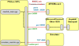

# PX4 Autonomous
Tested for Ubuntu 20.04
## Overview
This repository contains the packages needed to run a PX4 SITL Simulation with ROS2.<br>
Each of the folders in this repository is a ROS2 package. For this reason it must be cloned into your ROS2 workspace directory (for example ```~/ros2_ws```). The packages are:
- px4_autonomous: The main package, containing ROS2 nodes for PX4 Offboard control, transformations and visualization with rviz
- px4_autonomous_interfaces: ROS2 Messages, Actions and Services
- px4_msgs: ROS2 Messages corresponding to the PX4 uORB messages
## Architecture
The following diagram taken from the [PX4 documentation](https://docs.px4.io/main/en/simulation/#sitl-simulation-environment) shows how the different components are connected in a SITL environment:<br>
<br>
This repository implements an API/Offboard component as shown in the diagram. However it uses the newer [uXRCE-DDS](https://docs.px4.io/main/en/middleware/uxrce_dds.html) middleware instead of MAVLink for the communication with the PX4 flight controller.<br>
There are two launch files showing the different components needed for the full PX4 + ROS2 SITL Simulation:
- [px4_autonomous_sitl_launch.py](px4_autonomous/launch/px4_autonomous_sitl_launch.py): Launching PX4 flight controller, Gazebo, Micro XRCE-DDS Agent
- [px4_autonomous_launch.py](px4_autonomous/launch/px4_autonomous_launch.py):
Launching the node for Offboard control

## Prerequisites
#### ROS2 Environment
Follow the steps of the [ROS2 Foxy Documentation](https://docs.ros.org/en/foxy/Installation.html).
#### PX4 SITL Gazebo-Classic Environment
Follow the steps of the [PX4 Documentation](https://docs.px4.io/main/en/dev_setup/dev_env_linux_ubuntu.html#simulation-and-nuttx-pixhawk-targets).
It is assumed that the PX4 Code is cloned to ```~/```.
Additionally install the necessary dependencies:
```bash
sudo apt install ros-foxy-gazebo-ros-pkgs libgazebo-dev
sudo snap install micro-xrce-dds-agent --edge
```
Build the PX4 Autopilot for SITL Gazebo-Classic:
```bash
cd ~/PX4-Autopilot
DONT_RUN=1 make px4_sitl gazebo-classic
```
#### Build px4_autonomous
```bash
cd ~/ros2_ws/
git clone git@github.com:AImotion-Flight/px4_autonomous.git --recursive src/
colcon build
source install/setup.bash
```
## PX4 Autonomous
Launch the SITL simulation with:
```
ros2 launch px4_autonomous px4_autonomous_sitl_launch.py
```
Launch Offboard node:
```bash
ros2 launch px4_autonomous px4_autonomous_launch.py
```
## Multiple Vehicles
Multiple vehicles can be used by adding additional entries for each UAV to the arrays
in [px4_autonomous_sitl_launch.py](px4_autonomous/launch/px4_autonomous_sitl_launch.py#L93) and [px4_autonomous_launch.py](px4_autonomous/launch/px4_autonomous_launch.py#L8)